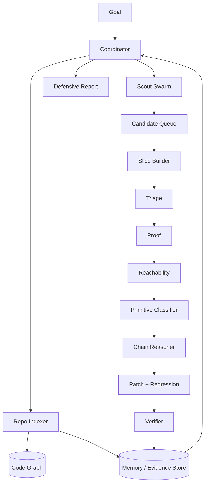

# Claude Mythos RE

A defensive reverse-engineering atlas for **Claude Mythos-style vulnerability discovery**: public bugs fixed, root-cause patterns, and the likely multi-agent orchestration layer behind finding chainable issues in huge codebases.

> No exploit code. No weaponized PoCs. This repo studies public patches and turns them into defensive scanner/orchestration ideas.

## What's inside

| Path | Purpose |
|---|---|
| [`docs/orchestration.md`](docs/orchestration.md) | Mermaid-heavy design for the coordinator, memory agent, scout swarm, proof loop, and chain reasoner |
| [`docs/bug-atlas.md`](docs/bug-atlas.md) | Publicly traceable Mythos / Claude / Anthropic-related fixes with commit IDs, patches, bug classes, and invariants |
| [`docs/root-cause-patterns.md`](docs/root-cause-patterns.md) | Pattern taxonomy extracted from the public fixes |
| [`docs/source-links.md`](docs/source-links.md) | Primary sources, advisory links, repo clone map, and local reproduction notes |
| [`data/bugs.yaml`](data/bugs.yaml) | Structured manifest for the bug atlas |
| [`patches/`](patches/) | Extracted public patch/advisory artifacts for quick reading |
| [`scripts/extract_patches.sh`](scripts/extract_patches.sh) | Rebuilds patch files from local source clones |

## Core thesis

Mythos probably does **not** load Linux, Firefox, or FFmpeg into one giant context. The public fixes look like an orchestration pattern:

```text
repo index -> invariant hypotheses -> targeted code slices -> proof/reachability loop -> primitive classification -> patch card
```

The shared memory layer is the real unlock: it stores code facts, rejected candidates, confirmed invariants, and historical bug patterns so specialist agents can work over small slices without forgetting the global map.

## High-signal public bugs

| Project | Bug shape | Invariant restored |
|---|---|---|
| OpenBSD TCP SACK | invalid SACK sequence accepted after integer overflow -> kernel crash | validate sequence ranges before SACK list handling |
| OpenBSD pgrp/fork | stale process-group pointer copied during fork | half-created child must not inherit live ownership pointers |
| FFmpeg H.264 | `0xFFFF` sentinel collision after 65,536 slices | runtime IDs must not collide with sentinel values |
| FFmpeg MPEG-TS IOD | stack OOB from shifted pointer + original capacity | pass remaining capacity after pointer shift |
| FFmpeg MPEG-TS JPEG-XS | UAF after early return following ownership transfer | all exits after ownership transfer must use normal cleanup |
| FreeBSD RPCSEC_GSS | unauthenticated stack overflow | protocol length must be bounded by destination size |
| FreeBSD TTY | dangling tty/session/process-group pointers | detach must clear both sides of a relation |
| FreeBSD PKRU | missed 1GB largepage/boundary page-table cases | walkers need every leaf and boundary case |
| Linux futex | mixed requeue flags break lifetime assumptions | both futex endpoints need identical semantics |
| Botan | certificate validation bypass | trust equality cannot be weak metadata equality |
| wolfSSL | signature verification invariant gap | digest size, key type, and signature OID must agree |
| Firefox 150 | DOM/Wasm/memory-safety batch | rare browser state combinations need invariant hardening |

## Orchestration sketch



More diagrams: [`docs/orchestration.md`](docs/orchestration.md).

## Scanner families worth building

- sentinel collision scanner
- shifted-pointer / stale-capacity scanner
- ownership-transfer early-return scanner
- protocol-length copy scanner
- bidirectional lifetime cleanup scanner
- crypto invariant scanner
- concurrency/race state scanner

## Fast reading path

```bash
less docs/orchestration.md
less docs/bug-atlas.md
less docs/root-cause-patterns.md
less patches/ffmpeg-2026-h264-slice-sentinel.patch
less patches/openbsd-2026-pgrp-race-uaf.patch
```

## Tag

```bash
git tag claude-mythos-re
```
