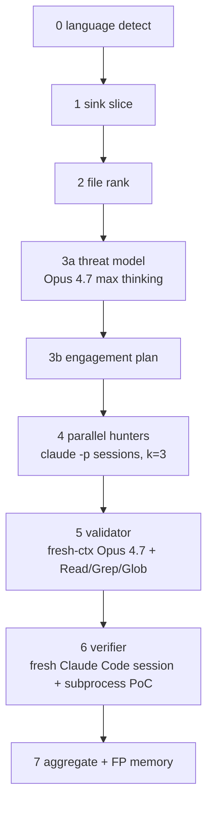

# Claude Mythos RE

A defensive reverse-engineering atlas for **Claude Mythos-style vulnerability discovery**, plus a manual scaffold (`mythos-lite`) that externalizes Mythos's in-model behavior for non-Mythos models (Opus 4.7, GPT-5.5).

> No exploit code. No weaponized PoCs. This repo studies public patches, dashboard data, and the Mythos Preview System Card.

## What's inside

| Path | Purpose |
|---|---|
| [`docs/orchestration.md`](docs/orchestration.md) | Corrected per system card: thin harness + capable model + in-model subagent spawning. Scanner family catalog at bottom. |
| [`docs/mythos-lite-v0.md`](docs/mythos-lite-v0.md) | Manual scaffold design — 7-phase pipeline, Anthropic-grounded decisions on sandbox + validator + state store. |
| [`docs/replications-diff.md`](docs/replications-diff.md) | Keyvanhardani vs FareedKhan outside-in replication scaffolds, code-level comparison. |
| [`docs/bug-atlas.md`](docs/bug-atlas.md) | Public Mythos / Claude / Anthropic-related fixes — commit IDs, patches, bug classes, invariants. Includes the 26 findings revealed 2026-05-20. |
| [`docs/root-cause-patterns.md`](docs/root-cause-patterns.md) | Pattern taxonomy extracted from the public fixes. |
| [`docs/source-links.md`](docs/source-links.md) | Primary sources, advisory links, repo clone map. |
| [`data/bugs.yaml`](data/bugs.yaml) | Structured manifest. |
| [`patches/`](patches/) | Extracted public fix commits — 30 original + 26 from the 2026-05-20 disclosure batch. |
| [`replications/`](replications/) | Cloned outside-in scaffolds: `keyvanhardani-mythos-research/`, `fareedkhan-mythos-architecture/`. |
| [`scripts/extract_patches.sh`](scripts/extract_patches.sh) | Rebuilds patch files from local source clones. |

## Core thesis — corrected 2026-05-27

The pre-system-card thesis (orchestration > giant context, with a coordinator-and-specialists swarm) was **partially wrong**. The April 2026 [Claude Mythos Preview System Card](https://www-cdn.anthropic.com/08ab9158070959f88f296514c21b7facce6f52bc.pdf) (§3.1, §3.3, §4.2.3, §7) makes the actual architecture clear:

- **One model + one thin agentic harness.** Anthropic's own phrasing: *"using an agentic harness with **minimal human steering**, it is able to autonomously find zero-days."*
- **1M-token context, used sparingly.** Mythos uses ~226K tokens per task vs Opus 4.6's 1.11M on long-context evals. It slices smartly but the harness doesn't enforce small slices.
- **Subagent spawning is in-model behavior**, not a hand-coded scaffold. Mythos directs its own subagents and catches their mistakes (§4 line ~2417, §7 lines ~6996–7048).
- **The 23,019 → 1,596 disclosure funnel** on the dashboard is a separate human/firm triage layer, not the discovery engine.

The capability gap (CyberGym 0.83 vs Opus 4.6's 0.67 in the same harness; Firefox 147 leveraging 4 distinct bugs to RCE where Opus 4.6 leverages 1) lives in the **model**, not the orchestration. See `docs/orchestration.md` for the corrected reading.

`mythos-lite` is therefore framed as **externalizing what Mythos does in-model** so non-Mythos models (Opus 4.7, GPT-5.5) can do similar work: explicit planner, parallel Claude Code hunter sessions, fresh-context validator, executable verifier in a docker sandbox, SQLite engagement graph. Full design: `docs/mythos-lite-v0.md`.

## High-signal public bugs (selected)

Originals plus the 2026-05-20 dashboard reveal. Full table in `docs/bug-atlas.md`.

| Project | Bug shape | Invariant restored |
|---|---|---|
| nginx | WebDAV alias underflow → unauth file write (CVE-2026-27654, critical) | validate destination URI length against alias before buffer calc |
| Nomad | host volume path traversal (CVE-2026-7474, critical) | canonicalize + bound host volume paths against root |
| Temporal | cross-namespace workflow manipulation (CVE-2026-5199, critical) | namespace scoping on every workflow op handler |
| Ghost | SQL injection in Content API (GHSA-w52v, critical) | parameterize all Content API queries |
| gitoxide | RCE on malicious-submodule update (GHSA-f26g, high) | validate submodule URL/path before update hooks |
| wolfSSL (×9 CVEs) | ARIA-GCM nonce reuse, ECCSI forgery, CMAC wraparound, ChaCha20-Poly1305 unverified tag, CMS GCM tag truncation, X509 leaf bypass, ECH overflow, X509 notAfter overflow | crypto invariants per primitive |
| Mastodon | LD-Sig bypass (named-graph) + IPv6 `::` SSRF | canonical JSON-LD + address validation |
| FreeRDP | 3 distinct heap overflows in cliprdr, planar RLE, sanitizer interceptor | bounds-check clipboard formats + planar offset/length |
| ImageMagick | MVG pattern CopyMagickString overflow | destination size = actual buffer length |
| libyang | XML metadata-list UAF | update list head atomically with element removal |
| OpenBSD TCP SACK | invalid SACK sequence accepted after integer overflow → kernel crash | validate sequence ranges before SACK list handling |
| OpenBSD pgrp/fork | stale process-group pointer copied during fork | half-created child must not inherit live ownership pointers |
| FFmpeg H.264 | `0xFFFF` sentinel collision after 65,536 slices | runtime IDs must not collide with sentinel values |
| FreeBSD RPCSEC_GSS | unauthenticated stack overflow | protocol length must be bounded by destination size |
| Linux futex | mixed requeue flags break lifetime assumptions | both futex endpoints need identical semantics |
| Firefox 150 | DOM/Wasm/memory-safety batch (Mozilla credits Mythos with 271 finds) | rare browser state combinations need invariant hardening |

## mythos-lite v0 pipeline



Anthropic-grounded decisions for every phase live in `docs/mythos-lite-v0.md`. Full code-level comparison of the two outside-in replications we studied: `docs/replications-diff.md`.

## Scanner families worth building (still hold post-correction)

- sentinel collision scanner (FFmpeg H.264)
- shifted-pointer / stale-capacity scanner (FFmpeg MPEG-TS IOD)
- ownership-transfer early-return scanner (FFmpeg JPEG-XS UAF)
- protocol-length copy scanner (FreeBSD RPCSEC_GSS, nginx WebDAV alias)
- bidirectional lifetime cleanup scanner (OpenBSD pgrp, FreeBSD TTY, libyang)
- crypto invariant scanner (Botan, all 9 wolfSSL CVEs)
- path / boundary scanner (Nomad, Temporal, MinIO, junrar)
- AEAD nonce + tag scanner (wolfSSL ARIA-GCM, ChaCha20-Poly1305, CMS GCM)
- concurrency/race state scanner

## Fast reading path

```bash
less docs/orchestration.md            # corrected thesis + system card citations
less docs/mythos-lite-v0.md           # our scaffold design
less docs/replications-diff.md        # the two scaffolds we studied
less docs/bug-atlas.md                # the public fix corpus
less patches/ffmpeg-2026-h264-slice-sentinel.patch
less patches/openbsd-2026-pgrp-race-uaf.patch
```

## Tag

```bash
git tag claude-mythos-re
```
