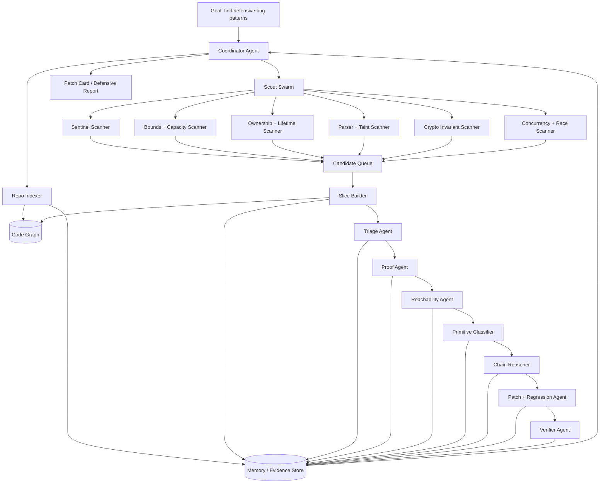
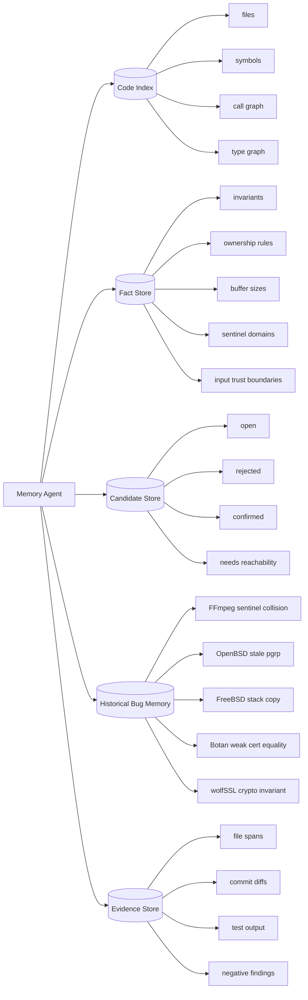
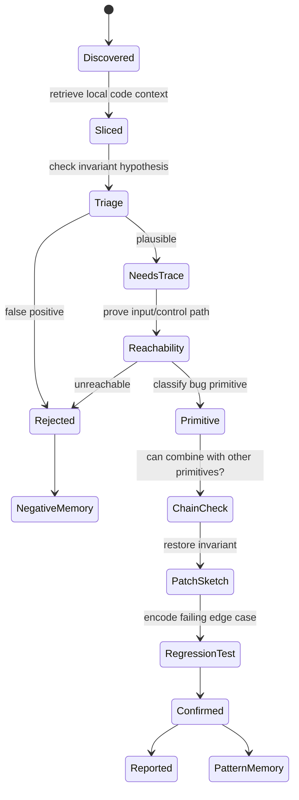
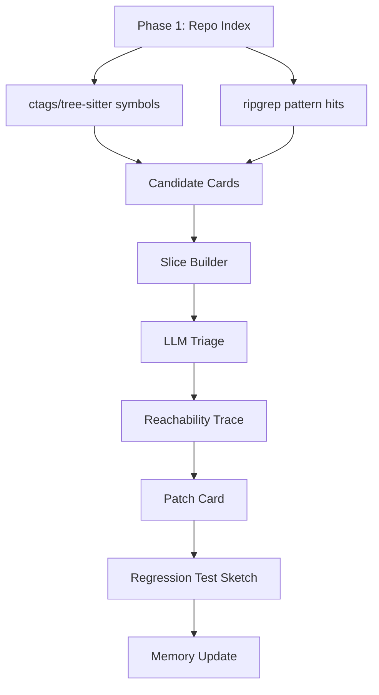

# Claude Mythos RE

Reverse-engineering the **orchestration pattern** behind Claude Mythos-style vulnerability discovery from the public bugs it helped fix.

> This is defensive research. It does not include exploit code or weaponized PoCs. The goal is to understand how an agentic system can reason over huge codebases without loading the whole repo into context.

**Tag:** `claude-mythos-re`

## Thesis

Mythos probably does **not** read a whole codebase in one context window. The public fixes point to a different architecture:

```text
small code slices + persistent memory + invariant scanners + specialist agents + proof loops
```

The strongest public examples are not random syntax bugs. They are broken invariants:

| Project | Public bug shape | Invariant that broke |
|---|---|---|
| OpenBSD TCP SACK | integer overflow -> invalid sequence accepted -> kernel crash | sequence ranges must be valid before SACK list handling |
| OpenBSD pgrp/fork | raceable stale process-group pointer | half-created child must not inherit live ownership pointers |
| FFmpeg H.264 | `0xFFFF` sentinel collision after 65,536 slices | runtime IDs must not equal sentinel values |
| FFmpeg MPEG-TS | stack OOB from shifted pointer + original capacity | remaining capacity must follow shifted output base |
| FFmpeg JPEG-XS/MPEG-TS | UAF after early return post ownership transfer | ownership transfer needs unified cleanup paths |
| FreeBSD RPCSEC_GSS | unauthenticated stack overflow | protocol length must be bounded by destination size |
| FreeBSD TTY | dangling tty/session back-pointers | detach must clear both sides of a relationship |
| FreeBSD PKRU | largepage/boundary traversal miss | page-table walkers need every leaf/boundary case |
| Linux futex | mixed flags break lifetime assumptions -> UAF | requeue endpoints must share object semantics |
| Botan | certificate validation bypass | trust equality cannot be DN/SKI metadata equality |
| wolfSSL | signature verification invariant gap | digest size, key type, and signature OID must agree |
| Firefox 150 | DOM/Wasm/memory-safety batch | many browser invariants break only in rare state combinations |

## Orchestration layer



## Why memory is central

A big repo needs a shared blackboard. Agent chat history is not enough.



Memory should store evidence, not vibes.

```yaml
candidate_id: ffmpeg-h264-slice-sentinel
pattern: sentinel_collision
file: libavcodec/h264_slice.c
invariant: slice_num must never equal 0xFFFF sentinel
evidence:
  - slice_table is uint16_t
  - empty entries initialized with memset(..., -1, ...)
  - current_slice increments without cap
  - fix rejects slice_num >= 0xFFFF
status: confirmed_public_fix
```

## Candidate lifecycle



## Context packet per agent

Each specialist should receive a bounded packet, not the repo:

```yaml
context_packet:
  candidate_id: freebsd-rpcsec-gss-stack-overflow
  files:
    - sys/rpc/rpcsec_gss/svc_rpcsec_gss.c
  spans:
    - function: svc_rpc_gss_validate
    - struct_defs: opaque_auth, rpc_msg
  facts:
    - oa_length is protocol-controlled
    - destination is stack-backed
    - fixed by explicit destination-size check
  task: prove or disprove length-to-copy overflow
```

## Primitive graph, not exploit script

The chain reasoner should model defensive primitives only.


No PoC needed. The useful output is:

```yaml
primitive_chain:
  input_control: network_or_file_or_syscall
  primitive_type: stack_oob | heap_oob | uaf | auth_bypass | info_leak
  boundary: parser | kernel | browser | crypto
  likely_impact: crash | memory_corruption | privilege_boundary
  missing_defense: exact invariant check
  weaponized_poc: false
```

## Scanner families

### 1. Sentinel collision scanner

Looks for:

```text
small integer table + memset(-1) + monotonic counter + equality guard
```

Public example: FFmpeg H.264 `0xFFFF` slice sentinel.

### 2. Shifted pointer / capacity scanner

Looks for:

```text
callee(ptr + used, original_capacity)
```

Public example: FFmpeg MPEG-TS IOD descriptor accounting.

### 3. Ownership transfer early-return scanner

Looks for:

```text
object->buf = other->buf
if (invalid) return error
cleanup later assumes old owner
```

Public example: FFmpeg MPEG-TS JPEG-XS UAF.

### 4. Protocol length copy scanner

Looks for:

```text
memcpy(stack_dst, input, protocol_len)
```

Public example: FreeBSD RPCSEC_GSS stack overflow.

### 5. Bidirectional lifetime scanner

Looks for detach/drop paths that clear only one side:

```text
session->tty = NULL
// but tty->session still points back
```

Public examples: OpenBSD pgrp and FreeBSD TTY.

### 6. Crypto invariant scanner

Looks for trust decisions based on weak equivalence:

```text
same subject/key id == same certificate
signature verifies without digest/key/OID agreement
```

Public examples: Botan and wolfSSL.

## Minimal implementation plan



A first version can be simple:

```text
rg patterns -> candidate YAML -> slice extraction -> model review -> markdown patch card
```

## Good output format

```yaml
id: openbsd-pgrp-race-uaf-like
status: plausible
pattern: stale_back_pointer
claim: child process can observe inherited pointer before fork finalization
proof_needed:
  - allocation lifetime of pgrp
  - race window during process_new/fork1
  - pool reuse path
patch_shape:
  - initialize pointer to NULL
  - set relation only after child state is consistent
risk: kernel object lifetime bug
```

## Research stance

This repo is about learning from public fixes:

- understand the invariant
- understand why humans/fuzzers missed it
- build defensive scanners
- produce patch cards and regression ideas
- avoid weaponized exploit construction

The banger insight: **the agent does not need to know everything. It needs to remember the right invariants and keep asking where the code violates them.**
