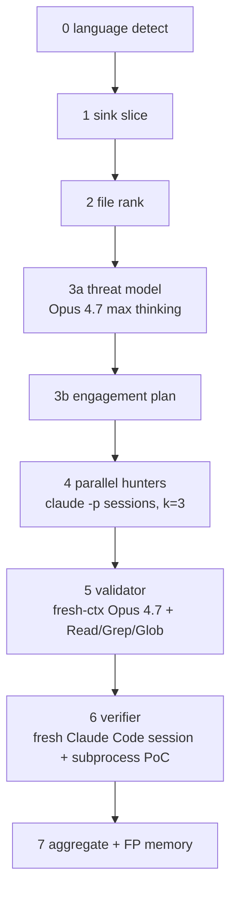

# Claude Mythos RE

A defensive reverse-engineering atlas for **Claude Mythos-style vulnerability discovery**, plus a manual scaffold (`mythos-lite`) that externalizes Mythos's in-model behavior for non-Mythos models (Opus 4.7, GPT-5.5).

> No exploit code. No weaponized PoCs. This repo studies public patches, dashboard data, and the Mythos Preview System Card.

**Primary sources:**
- [Claude Mythos Preview System Card](https://www-cdn.anthropic.com/08ab9158070959f88f296514c21b7facce6f52bc.pdf) (April 7, 2026, 245 pages)
- [Coordinated Vulnerability Disclosure dashboard](https://red.anthropic.com/2026/cvd/) (live, manifest SHA-3 `b7a0c5362...` as of 2026-05-22)
- [Coordinated Vulnerability Disclosure policy](https://www.anthropic.com/coordinated-vulnerability-disclosure) (timelines: 90d default / 7d active-exploit / 30d non-response / 45d post-patch detail hold)
- [Project Glasswing](https://www.anthropic.com/project/glasswing) — invitation-only access to Mythos Preview at $25 / $125 per M input/output tokens, ~50 partner orgs

**At a glance:**
- Dashboard funnel as of 2026-05-22: 23,019 candidates → 1,900 triaged → 1,726 verified (TPR 90.8%) → 1,596 disclosed → 1,451 acknowledged → 97 patched → 88 CVE/GHSA (26 public).
- 26 patches from the 2026-05-20 reveal batch are extracted into `patches/`.
- `mythos-lite` scaffold cost target: ~$56 per 10K-LOC target with k=3 + verifier; ~$15 stripped down for fast iteration.

## What's inside

| Path | Purpose |
|---|---|
| [`docs/orchestration.md`](docs/orchestration.md) | Corrected per system card: thin harness + capable model + in-model subagent spawning. Scanner family catalog at bottom. |
| [`docs/mythos-lite-v0.md`](docs/mythos-lite-v0.md) | Manual scaffold design — 7-phase pipeline, Anthropic-grounded decisions on sandbox + validator + state store. |
| [`docs/replications-diff.md`](docs/replications-diff.md) | Keyvanhardani vs FareedKhan outside-in replication scaffolds, code-level comparison. |
| [`docs/bug-atlas.md`](docs/bug-atlas.md) | Public Mythos / Claude / Anthropic-related fixes — commit IDs, patches, bug classes, invariants. Includes the 26 findings revealed 2026-05-20. |
| [`docs/root-cause-patterns.md`](docs/root-cause-patterns.md) | Pattern taxonomy extracted from the public fixes. |
| [`docs/source-links.md`](docs/source-links.md) | Primary sources, advisory links, repo clone map. |
| [`data/bugs.yaml`](data/bugs.yaml) | Structured manifest (56 entries, all patch references resolve). |
| [`patches/`](patches/) | Extracted public fix commits — 30 original + 26 from the 2026-05-20 disclosure batch. |
| `replications/` (gitignored) | Outside-in scaffolds. Setup commands below. |
| [`scripts/extract_patches.sh`](scripts/extract_patches.sh) | Rebuilds patch files from local source clones. |

## Core thesis — corrected 2026-05-27

The pre-system-card thesis (orchestration > giant context, with a coordinator-and-specialists swarm) was **partially wrong**. The April 2026 [System Card](https://www-cdn.anthropic.com/08ab9158070959f88f296514c21b7facce6f52bc.pdf) (§3.1, §3.3, §4.2.3, §7) makes the actual architecture clear. From §3.1:

> *"Claude Mythos Preview is a step-change in vulnerability discovery and exploitation: using an agentic harness with **minimal human steering**, it is able to autonomously find zero-days in both open-source and closed-source software… and in many cases, develop the identified vulnerabilities into working proof-of-concept exploits."*

What this means concretely:

- **One model + one thin agentic harness.** No coordinator-with-specialists pipeline.
- **1M-token context, used sparingly.** Mythos uses ~226K tokens per task vs Opus 4.6's 1.11M on long-context evals — it slices smartly, but the harness doesn't enforce small slices.
- **Subagent spawning is in-model behavior**, not a hand-coded scaffold. Mythos directs its own subagents and catches their mistakes (§4 line ~2417, §7 lines ~6996–7048).
- **Capability gap is in the model, not the orchestration.** CyberGym 0.83 vs Opus 4.6's 0.67 in the same harness; Firefox 147 leverages 4 distinct bugs to RCE where Opus 4.6 leverages 1.

`mythos-lite` is therefore framed as **externalizing what Mythos does in-model** so non-Mythos models (Opus 4.7, GPT-5.5) can do similar work: explicit planner, parallel Claude Code hunter sessions, fresh-context validator, executable verifier in a docker sandbox, SQLite engagement graph. Full design: `docs/mythos-lite-v0.md`.

## Scope & non-goals

**In scope (defensive):**
- Studying public maintainer-authored fix commits and the invariants they restore
- Designing a scaffold that approximates Mythos's discovery behavior for non-Mythos models
- Reading the System Card and dashboard payload as primary sources

**Out of scope:**
- No PoC code, no exploit chains, no weaponized payloads. The atlas links to public fixes, not crashes.
- No autonomous disclosure or autonomous patching. Any finding goes through human review per the [CVD policy](https://www.anthropic.com/coordinated-vulnerability-disclosure).
- No commercial replacement for [Claude Code Security](https://www.anthropic.com/research/claude-code-security) — Anthropic ships the productized version of this; `mythos-lite` is for learning.
- No attempt to close the model capability gap. The scaffold cannot make Opus 4.7 match Mythos at Firefox-class exploit construction.

## Selected public bugs

Full 56-row table in `docs/bug-atlas.md`. These are the highest-signal ones:

| Project | Bug shape | Invariant restored |
|---|---|---|
| nginx | WebDAV alias underflow → unauth file write (CVE-2026-27654, critical) | validate destination URI length against alias before buffer calc |
| Nomad | host volume path traversal (CVE-2026-7474, critical) | canonicalize + bound host volume paths against root |
| Temporal | cross-namespace workflow manipulation (CVE-2026-5199, critical) | namespace scoping on every workflow op handler |
| Ghost | SQL injection in Content API (GHSA-w52v / CVE-2026-26980, critical) | parameterize all Content API queries |
| gitoxide | RCE on malicious-submodule update (GHSA-f26g, high) | validate submodule URL/path before update hooks |
| wolfSSL (×9 CVEs) | ARIA-GCM nonce reuse, ECCSI forgery, CMAC wraparound, ChaCha20-Poly1305 unverified tag, CMS GCM tag truncation, X509 leaf bypass, ECH overflow, X509 notAfter overflow, AKI overflow | crypto invariants per primitive |
| Mastodon | LD-Sig bypass (named-graph) + IPv6 `::` SSRF | canonical JSON-LD + address validation |
| FreeRDP | 3 distinct heap overflows in cliprdr (capslen), planar RLE, gfx surface decode | per-callsite bounds checks |
| ImageMagick | MVG pattern CopyMagickString overflow | destination size = actual buffer length |
| libyang | XML metadata-list UAF | update list head atomically with element removal |
| OpenBSD TCP SACK | invalid SACK sequence accepted after integer overflow → kernel crash | validate sequence ranges before SACK list handling |
| OpenBSD pgrp/fork | stale process-group pointer copied during fork | half-created child must not inherit live ownership pointers |
| FFmpeg H.264 | `0xFFFF` sentinel collision after 65,536 slices | runtime IDs must not collide with sentinel values |
| FreeBSD RPCSEC_GSS | unauthenticated stack overflow | protocol length must be bounded by destination size |
| Linux futex | mixed requeue flags break lifetime assumptions | both futex endpoints need identical semantics |
| Firefox 150 | DOM/Wasm/memory-safety batch (Mozilla credits Mythos with 271 finds) | rare browser state combinations need invariant hardening |

## mythos-lite v0 pipeline



This pattern matches Anthropic's [Claude Code Security](https://www.anthropic.com/research/claude-code-security) (multi-stage verification + same-model fresh-context re-examination + severity + confidence + human-in-the-loop final approval) — we're externalizing the same coordination pattern they ship internally. Anthropic-grounded decisions for every phase live in `docs/mythos-lite-v0.md`. Code-level comparison of the two outside-in replications we studied: `docs/replications-diff.md`.

## Disclosure pipeline (separate from discovery)

The funnel on the dashboard is **operational orchestration**, not the discovery engine:

```text
23,019 candidates              (model + harness output)
   ↓ Anthropic / 6 external firms triage
 1,900 triaged → 1,726 verified (TPR 90.8%)
   ↓ capacity-bounded human review
 1,596 reported to maintainers (median 0.2d to ack)
   ↓ (median 6.2d to patch)
    97 patched · 88 advisories · 26 public on red.anthropic.com
```

[CVD policy](https://www.anthropic.com/coordinated-vulnerability-disclosure) timelines:
- **90-day** default public disclosure (14d extension if vendor making progress)
- **7-day** for actively-exploited critical bugs
- **30-day** non-response → escalate to external coordinator
- **45-day** post-patch hold before publishing full technical details

[Project Glasswing](https://www.anthropic.com/project/glasswing) ships Mythos to ~50 partner orgs (AWS, Apple, Broadcom, Cisco, CrowdStrike, Google, JPMorganChase, Linux Foundation, Microsoft, NVIDIA, Palo Alto Networks, +40 more) at $25 / $125 per M tokens. That's the access model — Mythos is not generally available.

## Scanner families worth building

- sentinel collision scanner (FFmpeg H.264)
- shifted-pointer / stale-capacity scanner (FFmpeg MPEG-TS IOD)
- ownership-transfer early-return scanner (FFmpeg JPEG-XS UAF)
- protocol-length copy scanner (FreeBSD RPCSEC_GSS, nginx WebDAV alias)
- bidirectional lifetime cleanup scanner (OpenBSD pgrp, FreeBSD TTY, libyang)
- crypto invariant scanner (Botan, all 9 wolfSSL CVEs)
- path / boundary scanner (Nomad, Temporal, MinIO, junrar)
- AEAD nonce + tag scanner (wolfSSL ARIA-GCM, ChaCha20-Poly1305, CMS GCM)
- concurrency/race state scanner

## Setup

```bash
git clone https://github.com/harsha-gouru/claude-mythos-re.git
cd claude-mythos-re

# Optional: re-clone the two outside-in scaffolds we studied
mkdir -p replications && cd replications
git clone --depth 1 https://github.com/Keyvanhardani/Mythos-research.git keyvanhardani-mythos-research
git clone --depth 1 https://github.com/FareedKhan-dev/claude-mythos-architecture.git fareedkhan-mythos-architecture
```

`replications/` is gitignored — the upstream repos are MIT/Apache, re-clone fresh.

## Fast reading path

```bash
less docs/mythos-lite-v0.md           # the scaffold design (start here)
less docs/orchestration.md            # corrected thesis + system card citations
less docs/replications-diff.md        # the two scaffolds we studied
less docs/bug-atlas.md                # the public fix corpus (56 entries)
less patches/nginx-2026-27654-webdav-alias-destination-length.patch
less patches/wolfssl-2026-5466-eccsi-r0-s0-forgery.patch
less patches/ffmpeg-2026-h264-slice-sentinel.patch
less patches/openbsd-2026-pgrp-race-uaf.patch
```
