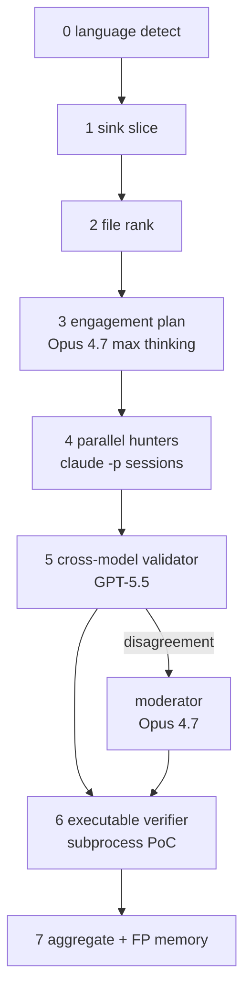
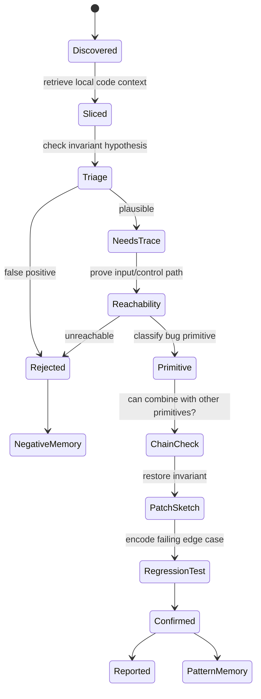

# Claude Mythos RE

Reverse-engineering Mythos-style vulnerability discovery from primary sources, then designing a manual scaffold that approximates it for non-Mythos models.

> Defensive research. No exploit code, no weaponized PoCs.

**Tag:** `claude-mythos-re`

## Updated 2026-05-27 — corrected after reading the system card

The earlier thesis on this page ("Mythos uses small slices + persistent memory + specialist agent swarm + proof loops") was **partially wrong**. Anthropic's [Claude Mythos Preview System Card](https://www-cdn.anthropic.com/08ab9158070959f88f296514c21b7facce6f52bc.pdf) (April 7, 2026, 245 pages) and the [coordinated vulnerability disclosure dashboard](https://red.anthropic.com/2026/cvd/) make the actual architecture clearer.

Key corrections:
1. Mythos is **one model + one thin agentic harness**, not a coordinator-with-specialists.
2. Mythos's context window is 1M tokens, not "small slices only". Per task it uses ~226K tokens vs Opus 4.6's 1.11M (system card §8) — it slices smartly, but the harness doesn't enforce small slices.
3. **Subagent spawning is in-model behavior**, not a hand-coded scaffold (§4.2.3, §7).
4. The 23,019 → 1,900 → 1,726 → 1,596 disclosure funnel is **a separate human/firm triage pipeline**, not the discovery engine.

The Mythos-specific scanner pattern catalog further down this page (sentinel collision, ownership transfer early-return, etc.) is still useful as scaffold-side guidance for non-Mythos models. The 12-box agent flowchart that used to live here is removed; see `docs/replications-diff.md` for why those reconstructions don't match Anthropic's own description.

## What Mythos actually is (primary-source)

From the system card §3.1:

> *"Claude Mythos Preview is a step-change in vulnerability discovery and exploitation: using an agentic harness with **minimal human steering**, it is able to autonomously find zero-days in both open-source and closed-source software… and in many cases, develop the identified vulnerabilities into working proof-of-concept exploits."*

Concretely (§3.3.1–3.3.3, §7, §8):

- **Model**: a specialized frontier checkpoint, internally codenamed Capybara, sits above Opus 4.6, 1M-token context. Saturates Cybench (100% pass@1), CyberGym 0.83 vs Opus 4.6's 0.67 (same harness, model-only delta), and dominates Firefox 147 SpiderMonkey exploit construction (leverages 4 distinct bugs to RCE; Opus 4.6 leverages 1 unreliably).
- **Harness**: container + target source + a testing harness tailored to the artifact (e.g. SpiderMonkey shell mimicking a Firefox content process without sandbox) + standard tools (compiler, ASan/UBSan, gdb, shell). Named scaffolds in the card: `Terminus-2` for Terminal-Bench, `Harbor` as the overall agentic infrastructure, plus a SWE-bench Multimodal test harness. No special "Mythos cyber pipeline" is described — the cyber tasks reuse the generic agentic substrate.
- **Subagents**: spawned by Mythos itself at runtime. §4 (~line 2417): *"Mythos Preview (which is directing the subagents) successfully follows up with its subagents until it is justifiably confident."* §7 (~line 6996): *"fires off subagents to parallelize research."* §7 (~line 7016): *"when one of its own subagents returned incorrect information, Claude Mythos Preview noticed, diagnosed why the subagent had made a mistake, and fixed the underlying issue."*
- **Pacing**: $20/$100 per M input/output tokens for partner access (per CSA's recap of Anthropic's announcement). Mythos uses *fewer* tokens per task than Opus 4.6 on long-context evals (§8).

So Mythos is **not** "one giant context loading whole codebases" *and* **not** "a hand-coded multi-agent pipeline". It's a strong model in a thin harness that decides for itself when to fan out and remembers what its subagents have found inside its long context.

## The disclosure pipeline is a separate layer

The big multi-stage funnel on the dashboard happens **after** the model finds a bug:

```text
Mythos discovery (model + harness)
  ↓
23,019 candidate findings
  ↓ (Anthropic / 6 external firms triage)
1,900 reviewed
  ↓ (90.8% TPR)
1,726 verified
  ↓ (capacity-bounded)
1,596 reported to maintainers
  ↓ (median 0.2 days)
1,451 acknowledged
  ↓ (median 6.2 days)
97 patched · 88 CVE/GHSA · 26 public as of 2026-05-22
```

This is operational orchestration — human reviewers, security firms, maintainer outreach, hash-commitment ledger (SHA-3-512 per finding). It does not describe what the model does. See `docs/disclosure-policy.md` for the CVD timelines (90d default / 7d active-exploit / 30d non-response / 45d post-patch detail hold).

## Manual scaffold for non-Mythos models

Mythos is invitation-only. To approximate it with public models (Opus 4.7, GPT-5.5, DeepSeek V4), externalize what Mythos does in-model:

| Mythos in-model | mythos-lite external |
|---|---|
| Plans what to look at next | Explicit planner pass — one Opus call, max thinking |
| Spawns and directs subagents | Coordinator script that fans out N parallel Claude Code CLI sessions |
| Catches subagent mistakes | Cross-model validator + skeptical re-read |
| Holds plan + facts in 1M ctx | SQLite engagement graph |
| Uses sanitizers, shells, debuggers | Scratch build sandbox + ASan/UBSan |
| Proves the bug with a PoC | Subprocess verification gate with sentinel-write |

Full design lives in `docs/mythos-lite-v0.md`. The 7-phase pipeline:



This is closer to Keyvanhardani's bash scaffold than FareedKhan's notebook reconstruction. See `docs/replications-diff.md` for the comparison.

## Public bug atlas (still load-bearing)

The scanner families below still hold value: they're the **patterns mythos-lite hunters should be primed to look for** in any source tree, regardless of which model is doing the hunting. They're derived from public fixes attributable to Mythos-style discovery.

| Project | Public bug shape | Invariant restored |
|---|---|---|
| nginx WebDAV | size_t underflow → unauth file write (CVE-2026-27654) | destination URI bounds before alias path build |
| wolfSSL (×9 CVEs) | nonce reuse, sig forgery, CMAC wraparound, ECH overflow, cert bypass | crypto invariants per primitive |
| Nomad | path traversal in `host_volume_plugin.go` (CVE-2026-7474) | filename sanitization at sink |
| Temporal | cross-namespace workflow manipulation (CVE-2026-5199) | namespace boundary enforcement |
| Ghost SQLi | Content API SQL injection (GHSA-w52v-v783-gw97) | parameterized queries at API surface |
| FFmpeg H.264 | 0xFFFF sentinel collision after 65,536 slices | runtime IDs must not equal sentinel values |
| FFmpeg MPEG-TS IOD | stack OOB from shifted pointer + original capacity | pass remaining capacity after pointer shift |
| FFmpeg JPEG-XS | UAF after early return post ownership transfer | ownership transfer needs unified cleanup |
| FreeBSD RPCSEC_GSS | unauthenticated stack overflow | protocol length bounded by destination size |
| FreeBSD TTY | dangling tty/session back-pointers | detach clears both sides of relation |
| FreeBSD PKRU | largepage/boundary traversal miss | walkers cover every leaf and boundary |
| OpenBSD TCP SACK | integer overflow → invalid seq accepted | sequence range validation before SACK list |
| OpenBSD pgrp/fork | stale back-pointer on fork | half-created child must not inherit live ownership |
| Linux futex | mixed flags → UAF | both endpoints share lifetime semantics |
| Botan | weak-equivalence cert trust | trust equality cannot be DN/SKI metadata equality |
| Mastodon | LD-Sig bypass, IPv6 SSRF | canonical JSON-LD + address validation |
| Firefox 147/150 | DOM/Wasm batch | rare state combos need invariant hardening |

The dashboard payload (`mythos_payload.json` from red.anthropic.com) shows the full bug-class distribution across all 1,596 disclosed findings: heap-buffer-overflow 162, auth-bypass 116, broken-access-control 88, type-confusion 71, denial-of-service 66, use-after-free 56, stack-buffer-overflow 49. The "other" bucket is 512 — taxonomy is coarse.

## Memory is still central (for non-Mythos models)

Mythos holds everything in 1M context. Non-Mythos models need an external blackboard. For mythos-lite, that's the SQLite engagement graph (six tables, lifted from FareedKhan's reconstruction with two additions for FP memory):

- `surface` — endpoints, routes, sink call sites
- `facts` — atomic statements an agent has confirmed
- `hypotheses` — candidates with status (open / testing / confirmed / refuted)
- `findings` — confirmed bugs with evidence + corroborators + verifier result
- `dead_ends` — paths explored and ruled out
- `chains` — assembled attack paths (deferred to v1)
- `dismissals` — cross-session FP memory keyed by `target_id`
- `runs` — engagement metadata

Schema details in `docs/mythos-lite-v0.md`.

## Candidate lifecycle



In mythos-lite this maps to: hunter → validator → moderator (on disagreement) → verifier → engagement-graph status transitions → dismissals writeback.

## Context packet per agent

Each subagent gets a bounded packet, not the repo:

```yaml
context_packet:
  candidate_id: freebsd-rpcsec-gss-stack-overflow
  files:
    - sys/rpc/rpcsec_gss/svc_rpcsec_gss.c
  spans:
    - function: svc_rpc_gss_validate
    - struct_defs: opaque_auth, rpc_msg
  facts:
    - oa_length is protocol-controlled
    - destination is stack-backed
    - fixed by explicit destination-size check
  task: prove or disprove length-to-copy overflow
```

For mythos-lite this is assembled by the coordinator from the engagement graph plus the sink-slicer output before each hunter call.

## Primitive graph, not exploit script

The chain reasoner (deferred to v1) should model defensive primitives only.


Output is a defensive description, never a weaponized PoC:

```yaml
primitive_chain:
  input_control: network_or_file_or_syscall
  primitive_type: stack_oob | heap_oob | uaf | auth_bypass | info_leak
  boundary: parser | kernel | browser | crypto
  likely_impact: crash | memory_corruption | privilege_boundary
  missing_defense: exact invariant check
  weaponized_poc: false
```

## Scanner families (hunter prompts should be primed for these)

### 1. Sentinel collision scanner

```text
small integer table + memset(-1) + monotonic counter + equality guard
```
Public example: FFmpeg H.264 `0xFFFF` slice sentinel.

### 2. Shifted pointer / capacity scanner

```text
callee(ptr + used, original_capacity)
```
Public example: FFmpeg MPEG-TS IOD descriptor accounting.

### 3. Ownership transfer early-return scanner

```text
object->buf = other->buf
if (invalid) return error    // cleanup later assumes old owner
```
Public example: FFmpeg MPEG-TS JPEG-XS UAF.

### 4. Protocol length copy scanner

```text
memcpy(stack_dst, input, protocol_len)
```
Public examples: FreeBSD RPCSEC_GSS, nginx WebDAV alias underflow.

### 5. Bidirectional lifetime scanner

Detach/drop paths that clear only one side:

```text
session->tty = NULL
// but tty->session still points back
```
Public examples: OpenBSD pgrp, FreeBSD TTY.

### 6. Crypto invariant scanner

Trust decisions based on weak equivalence:

```text
same subject/key id == same certificate
signature verifies without digest/key/OID agreement
nonce reuse in AEAD
truncated AEAD tag accepted
```
Public examples: Botan, the 9 wolfSSL CVEs from the May-20 disclosure batch.

### 7. Path / boundary scanner

```text
user-supplied path joined to base without canonicalization
namespace identifier accepted without scope check
```
Public examples: Nomad path traversal, Temporal cross-namespace, MinIO storage path.

## Good output format

```yaml
id: openbsd-pgrp-race-uaf-like
status: plausible
pattern: stale_back_pointer
claim: child process can observe inherited pointer before fork finalization
proof_needed:
  - allocation lifetime of pgrp
  - race window during process_new/fork1
  - pool reuse path
patch_shape:
  - initialize pointer to NULL
  - set relation only after child state is consistent
risk: kernel object lifetime bug
```

## Research stance

This repo is about learning from public fixes and externalizing Mythos's in-model behavior for public models:

- understand the invariant that broke
- understand why humans/fuzzers missed it
- build defensive scanners primed for that pattern
- produce patch cards and regression ideas
- avoid weaponized exploit construction

The corrected insight: **the model does the hard reasoning. The scaffold's job is to give a non-Mythos model the orchestration that Mythos has built in — parallelism, fresh-context isolation, cross-model skepticism, executable verification, persistent memory.**

## Related docs

- `docs/replications-diff.md` — Keyvanhardani vs FareedKhan code-level comparison
- `docs/mythos-lite-v0.md` — our scaffold design
- `docs/bug-atlas.md` — public Mythos-attributable fixes
- `docs/root-cause-patterns.md` — patterns extracted from those fixes
- `docs/source-links.md` — primary sources + repo clone map
